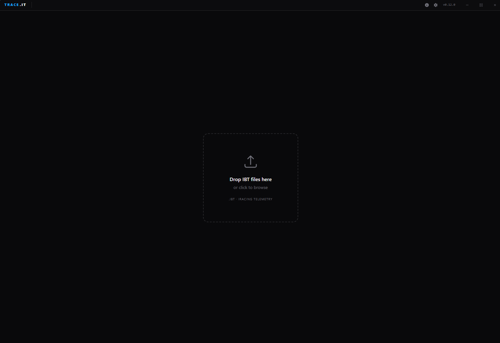
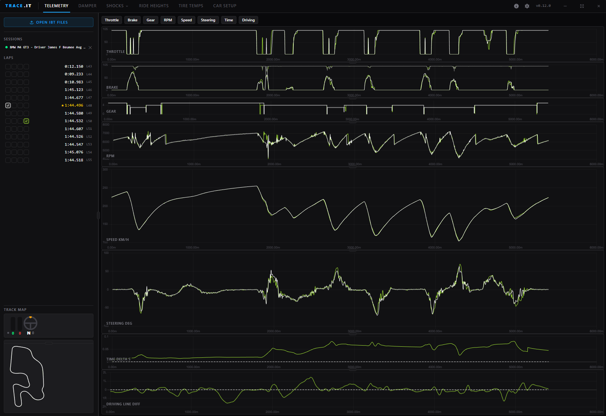
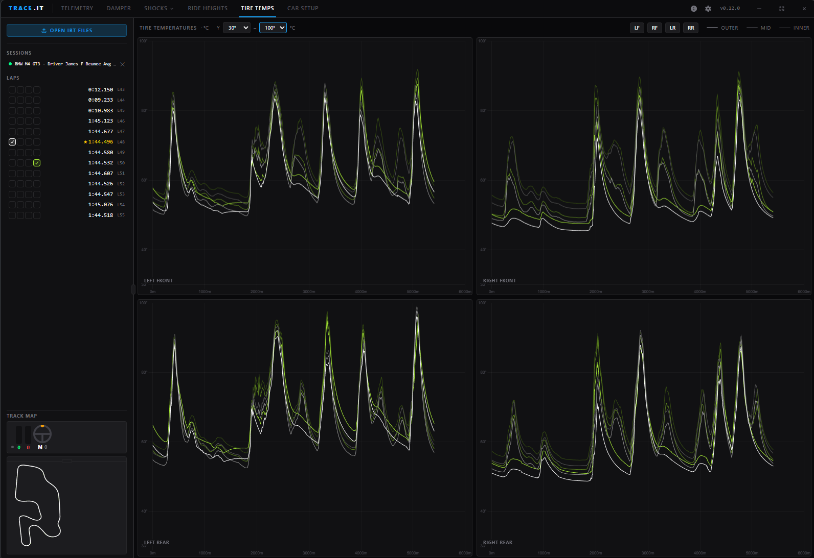
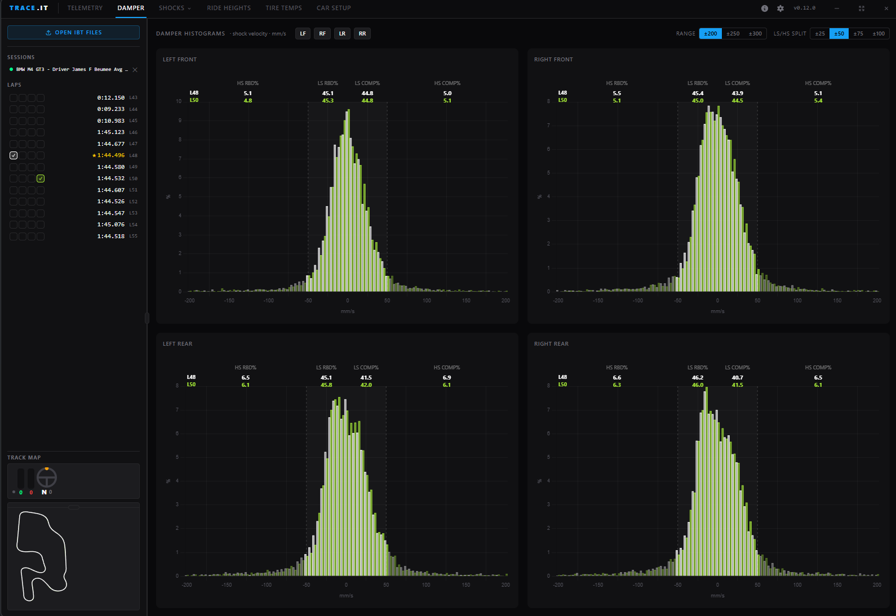
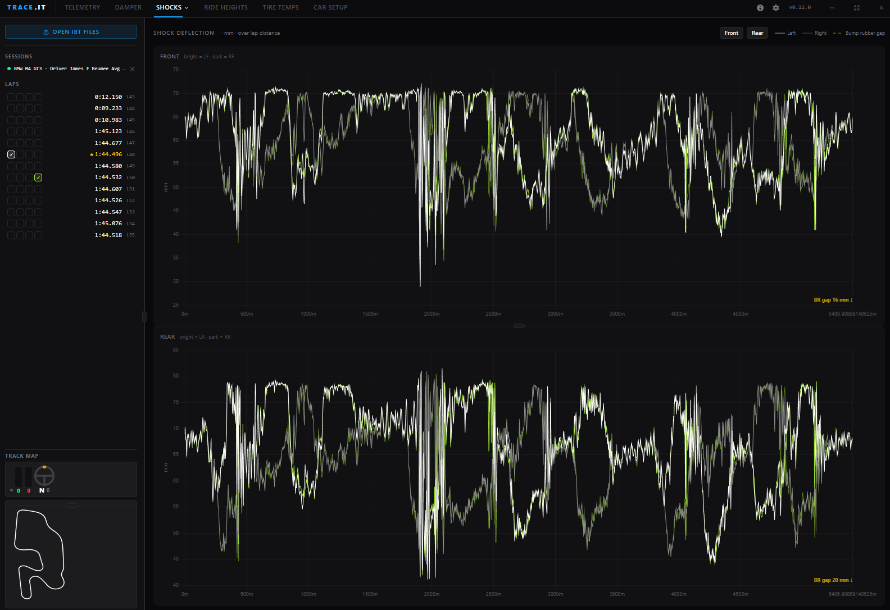
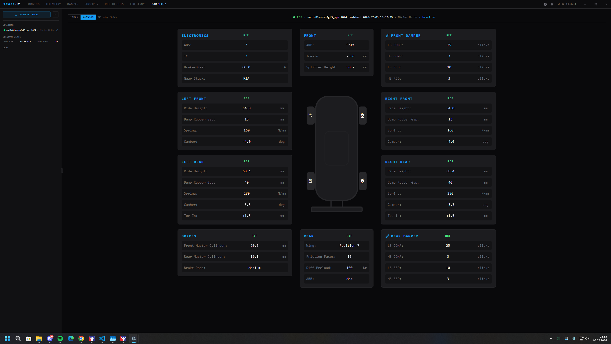

# TRACE.IT — iRacing Telemetry Analysis Tool

> A free, open-source desktop app for analysing iRacing `.ibt` telemetry files. Compare laps side-by-side, inspect suspension data, diff setups, and find time across every corner — all without leaving your desktop.

---

## Table of Contents

- [What is TRACE.IT?](#what-is-traceit)
- [Feature Overview](#feature-overview)
- [Installation](#installation)
  - [For Drivers (no coding required)](#for-drivers-no-coding-required)
  - [For Developers](#for-developers)
- [Quick Start Guide](#quick-start-guide)
- [Feature Guide](#feature-guide)
  - [Telemetry](#-telemetry)
  - [Ride Height](#-ride-height)
  - [Tire Temperatures](#-tire-temperatures)
  - [Damper Histograms](#-damper-histograms)
  - [Shock Deflection](#-shock-deflection)
  - [Shock Velocity Traces](#-shock-velocity-traces)
  - [Setup Diff](#-setup-diff)
  - [Track Map](#-track-map)
- [Loading Multiple Sessions](#loading-multiple-sessions)
- [Keyboard & Mouse Controls](#keyboard--mouse-controls)
- [Glossary](#glossary)
- [FAQ](#faq)
- [Project Structure (for developers)](#project-structure-for-developers)
- [Contributing](#contributing)

---

## What is TRACE.IT?

TRACE.IT is a telemetry analysis tool built specifically for [iRacing](https://www.iracing.com/). It reads the `.ibt` binary telemetry files that iRacing writes to disk after every session and lets you:

- **Overlay multiple laps** on synchronised charts to find where you're losing or gaining time
- **Inspect suspension behaviour** — ride height, shock deflection, and damper velocity histograms
- **Monitor tyre health** — temperature gradients across all four corners
- **Compare car setups** side-by-side across different sessions
- **Follow a live cursor** on a track map that moves in sync with every chart

TRACE.IT runs entirely offline. No data is uploaded anywhere. All processing happens in memory on your machine.

### Who is this for?

| User | How you benefit |
|------|----------------|
| Club/amateur racer | Find where you're braking too late or understeering — without needing a data engineer |
| Sim racing coach | Share a session file with a student and walk through every trace together |
| Developer  | Lightweight codebase with a documented IBT parser — easy to extend with new channels |

---

## Feature Overview

| Tab | What it shows |
|-----|---------------|
| **Telemetry** | Throttle, Brake, Speed, Gear, Steering, RPM — synced line charts across selected laps |
| **Ride Height** | Splitter + per-corner ride height over lap distance |
| **Tire Temp** | Inner / mid / outer tyre temperatures for all four corners |
| **Damper** | Shock velocity histograms with low-speed / high-speed zone breakdown |
| **Shocks** | Shock deflection traces with bump-rubber gap reference line |
| **Shock Vel** | Shock velocity traces over lap distance (all four corners) |
| **Setup** | Car setup diff table across all loaded sessions |

**Sidebar (always visible):**
- Session list with file names
- Lap list — click to assign a colour slot; hover to see air temp, track temp, humidity, and fuel consumption

---

## Screenshots





---

## Installation

### For Drivers (no coding required)

1. Go to the [**Releases**](https://github.com/naizens/TRACE.IT/releases) page.
2. Download the installer for your OS:
   - **Windows:** `TRACE.IT-Setup-x.y.z.exe`
   - **macOS:** `TRACE.IT-x.y.z.dmg`
3. Run the installer and follow the prompts.
4. Launch TRACE.IT from your desktop or Start Menu.

> **macOS note:** On first launch macOS may warn "unidentified developer". Right-click the app → Open → Open to bypass Gatekeeper.

Updates are delivered automatically in the background. When a new version is ready, a banner appears in the top-right corner — click **Restart now** to apply it.

### For Developers

**Prerequisites:** Node.js 20+ and npm 10+.

```bash
# 1. Clone the repo
git clone https://github.com/naizens/TRACE.IT.git
cd TRACE.IT

# 2. Install dependencies
npm install

# 3. Start the dev server (hot-reload for renderer + live Electron window)
npm run dev
```

Other useful commands:

```bash
npm run typecheck   # TypeScript type-check (no emit)
npm run build       # Compile to out/
npm run dist        # Build + package installer → release/
```

---

## Quick Start Guide

1. **Open TRACE.IT.** You'll see a drag-and-drop zone.
2. **Load a file.** Either drag one or more `.ibt` files onto the window, or click **Open IBT Files** in the sidebar.
3. **Pick laps to compare.** In the lap list on the left, click a lap to assign it a colour:
   - Each click cycles through four colour slots: **green (ref) → blue → pink → lime**.
   - A second click on an already-coloured lap removes it.
   - Up to four laps can be active at once (across any combination of sessions).
4. **Switch tabs** at the top to explore different data views.
5. **Hover over any chart** to see a synchronised crosshair across all panels and a live position marker on the track map.
6. **Scroll to zoom** the X-axis (lap distance). Double-click to reset zoom.

> **Tip:** Hover a lap row in the sidebar to see a tooltip with session conditions — air temp, track temp, relative humidity, and fuel used.

---

## Feature Guide

### 📈 Telemetry

The Telemetry tab shows the classic "trace comparison" view: multiple channels plotted against **lap distance** (in metres) with every chart locked to the same X-axis.

**Available channels (toggle with the buttons at the top):**

| Channel | Unit | What to look for |
|---------|------|-----------------|
| Throttle | % | Trailing throttle, early application points |
| Brake | % | Brake point, pressure ramp, release shape |
| Speed | km/h or mph | Min speed at apex, top speed on straights |
| Gear | — | Gear selection consistency |
| Steering | degrees | Smoothness, peak angle, steering input while braking |
| RPM | rpm | Shift points |

**Interactions:**
- **Hover** — crosshair follows mouse; all charts and the track map cursor update together
- **Scroll** — zoom in / out on lap distance
- **Drag resize handle** between charts to adjust panel heights
- **Double-click a resize handle** to reset all panels to equal height
- **Double-click a chart** to reset zoom

---

### 📐 Ride Height

Three synced panels showing ride height over lap distance:

| Panel | What it shows |
|-------|--------------|
| **Splitter** | Average of Left Front + Right Front — useful for aero/underfloor clearance |
| **Front** | LF (bright) vs RF (dark) — asymmetry reveals camber/spring imbalance |
| **Rear** | LR (bright) vs RR (dark) |

**What to look for:** Low ride height through high-speed corners indicates the car is running on the floor / splitter. Sudden drops to zero suggest a ride height sensor dropout.

---

### 🌡️ Tire Temperatures



A 2×2 grid (one panel per corner) showing **Inner / Mid / Outer** surface temperatures over lap distance.

The Y-axis range is adjustable — use the min/max inputs in the header to focus on the relevant temperature window for your tyre compound.

**What to look for:**
- **Outer > Inner** → understeer / too little front negative camber
- **Inner > Outer** → oversteer / too much negative camber
- **Consistent across laps** → your tyre management is stable; differences point to varying track conditions or driving style

---

### 📊 Damper Histograms



A **velocity histogram** per corner — how much time (as a fraction of the lap) the shock spent at each velocity bin (mm/s).

**Controls:**
- **Range:** ±50 / ±100 / ±200 mm/s — zoom in on slow-speed events or capture the full range
- **LS/HS split:** The dividing line between Low-Speed (LS) and High-Speed (HS) damper zones. Common values: ±25, ±50, ±75 mm/s

**Zone percentages** are shown on each bar group — the fraction of time in LS bump, LS rebound, HS bump, and HS rebound.

**What to look for:** A well-set car typically spends most time in the LS zone. A spike into HS territory on a specific corner suggests a kerb strike or severe bottoming. Comparing a "good lap" against a "bad lap" histogram quickly shows where the suspension was upset.

---

### 🔩 Shock Deflection



Front and rear shock deflection over lap distance, with a **bump-rubber gap** reference line drawn from the car setup YAML embedded in the IBT file.

**What to look for:** When the deflection trace touches or crosses the bump-rubber line, the car is bottoming on that corner. This is useful for identifying whether your springs or bump stops need adjustment.

---

### 〰️ Shock Velocity Traces

Shock velocity (mm/s) for all four corners plotted over lap distance — the time-domain version of the Damper histogram.

Use this alongside the histogram to pinpoint *where on track* high-speed events occur rather than just *how often*.

---

### 🔧 Setup Diff



A table comparing car setup values across all loaded sessions. Differences are highlighted so you can instantly see what changed between a morning and afternoon session, or between your setup and a coach's reference file.

> Load two or more `.ibt` files from different sessions to populate this view.

---

### 🗺️ Track Map

A canvas-based track map reconstructed from telemetry using dead-reckoning (`Speed + Yaw`). No track database required — the shape is derived entirely from the data in the IBT file.

- The **coloured dot** moves in sync with the chart crosshair
- The map is shown in the lower section of the sidebar and is visible on all tabs
- The **Telemetry Bar** above the map shows live channel values at the cursor position

---

## Loading Multiple Sessions

TRACE.IT supports loading several `.ibt` files simultaneously:

1. Click **Open IBT Files** and select multiple files (or drag them all at once).
2. Each session appears as a separate entry in the session list.
3. Laps from different sessions can be assigned colour slots and compared on the same charts.

> **Note:** The track map and some views (Telemetry, Ride Height, Shocks) use only the **first loaded session's** track layout. The Setup tab compares all sessions.

---

## Keyboard & Mouse Controls

| Action | How |
|--------|-----|
| Pan chart X-axis | Scroll wheel over any chart |
| Zoom chart X-axis | Ctrl + drag on any chart |
| Reset zoom | Double-click any chart |
| Pin / scrub cursor | Click or click-and-drag on any chart |
| Resize chart panels | Drag the handle between panels |
| Reset panel heights | Double-click the resize handle |
| Assign lap colour | Click lap row in sidebar |
| Remove lap colour | Click a coloured lap row until it cycles off |
| See lap conditions | Hover lap row in sidebar |

---

## Glossary

| Term | Meaning |
|------|---------|
| **IBT** | iRacing's binary telemetry format (`.ibt` files). Recorded automatically during sessions if telemetry capture is enabled in iRacing settings. |
| **LapDist** | Distance from the start/finish line along the racing line, in metres. Used as the X-axis for all trace charts. |
| **Shock Deflection** | How compressed the shock absorber is at a given point. Higher = more compressed. |
| **Shock Velocity** | How fast the shock is moving (mm/s). Positive = bump (compression), negative = rebound. |
| **LS / HS (Low-Speed / High-Speed)** | Refers to shock *shaft velocity*, not car speed. Low-speed events are smooth inputs (aero, weight transfer); high-speed events are kerb strikes and road bumps. |
| **Ride Height** | The gap between the car's floor / splitter and the road surface, in millimetres. |
| **Bump Rubber / Bump Stop** | A rubber insert inside the shock that limits travel at full compression. When the shock hits it, behaviour changes abruptly. |
| **Colour Slot** | One of four assignable colours (green / blue / pink / lime) used to identify a lap on charts. Green is the "reference" lap. |
| **Dead Reckoning** | Estimating position by accumulating speed and direction over time. TRACE.IT uses this to draw the track shape without a GPS track database. |

---

## FAQ

**Where does iRacing store IBT files?**

By default: `Documents\iRacing\telemetry\`. You need to enable telemetry capture in iRacing → Options → Drive → "Record telemetry". Set it to "Always" or "When in car".

**Why does my track map look wrong?**

Dead-reckoning drift accumulates over a lap. Out-laps and in-laps look worst because the car is moving slowly or off-line. Full flying laps are usually accurate.

**Can I use this offline?**

Yes — 100% offline. No internet connection is needed.

**Which platforms are supported?**

Windows 10/11 and macOS 12+. Linux is not officially supported (Electron runs on Linux but no installer is provided).

**Can I export data to CSV / MoTeC?**

Not currently. TRACE.IT is a viewer, not an exporter. If you need MoTeC i2 export, look at [Mu](https://github.com/patrickmoore/Mu).

**The app says "No shock velocity data found"**

Some older IBT files or certain cars don't export suspension channels. There's nothing TRACE.IT can do — the data simply wasn't recorded.

**How do I enable telemetry recording in iRacing?**

iRacing main menu → Options → Drive → scroll to "Telemetry" section → set **Record telemetry** to **Always** (or **When in car**).

---

## Project Structure (for developers)

```
src/
  main/
    index.ts           — Electron main process: window, IPC handlers, auto-updater
    ibt-parser.ts      — Binary IBT parser → returns ParsedSession via IPC
  preload/
    index.ts           — contextBridge: exposes window.electronAPI to renderer
  renderer/src/
    App.tsx            — Root component: tab routing, TitleBar, Sidebar, DropZone
    types/session.ts   — ParsedSession, LapInfo, SessionMeta, LapColor types
    store/useStore.ts  — Zustand store: sessions[], selections{}, activeTab, theme
    lib/
      constants.ts       — LAP_COLORS, COLOR_ORDER, CHART_CONFIGS
      interpolate.ts     — Binary-search linear interpolation
      formatters.ts      — formatLapTime, arrayMax/Min, darken()
      chartSetup.ts      — Chart.js global register + SyncCursor plugin
      buildChartData.ts  — Shared dataset builder (used by Telemetry, TireTemp, etc.)
      syncChartConfig.ts — buildZoomPlugin, buildClickHandler
    components/
      ui/                — Button, UpdateBanner, ChangelogModal, Modal
      layout/            — TitleBar, Sidebar, DropZone
    hooks/
      useChartSync.ts      — Imperative hover/zoom/click sync across all charts
      useTrackMapUpdate.ts — Reads Zustand, calls trackMapRef.updateMarker()
    features/
      sessions/          — SessionList, LapList (with hover tooltip)
      telemetry/         — TelemetryView, ChartPanel, createChartOptions
      rideheight/        — RideHeightView, RidePanel
      tiretemp/          — TireTempView
      damper/            — DamperView, CornerHistogram
      shocks/            — ShocksView, ShockPanel (deflection + bump-rubber)
      shockvel/          — ShockVelocityView (velocity traces)
      setup/             — SetupView (setup diff table)
      trackmap/          — TrackMap (canvas), TelemetryBar, index.ts (barrel)
```

### Key architectural notes

**IBT Parsing** runs entirely in the Electron main process (Node.js). The renderer never touches the file directly — it receives a `ParsedSession` object via IPC (`open-ibt-files` channel). Only channels in the `NEEDED_VARS` Set are extracted; add a new channel name there to expose it to the renderer.

**Chart synchronisation** is fully imperative — no React state is updated on hover or zoom. Chart.js instances are stored in refs and called directly. This keeps the UI at 60 fps even with 7000+ data points per chart.

**Chart options** are created once via `useMemo([])`. Callbacks inside them read live values through **mutable refs** to avoid stale closures.

**Track map** uses canvas + `forwardRef` / `useImperativeHandle` to expose `updateMarker(lapDist)`. Always import from the barrel (`features/trackmap/index.ts`).

### Adding a new telemetry channel

1. Add the channel name to `NEEDED_VARS` in `src/main/ibt-parser.ts`.
2. Add a `CHART_CONFIGS` entry in `src/renderer/src/lib/constants.ts`.
3. Wire it into `buildChartData.ts` if it belongs on the Telemetry tab, or build a new feature view.

### IBT header offsets (verified)

| Field | Offset |
|-------|--------|
| tickRate | 8 |
| sessionInfoLen | 16 |
| sessionInfoOffset | 20 |
| numVars | 24 |
| varHeaderOffset | 28 |
| bufLen | 36 |
| varBuf[0].bufOffset | 52 |
| numSamples | 140 |

Variable descriptor: 144 bytes — `type@+0`, `offset@+4`, `name@+16` (char[32], ASCII, null-terminated).

---

## Contributing

Pull requests are welcome. Before opening one:

1. Run `npm run typecheck` — no type errors allowed.
2. Keep changes focused; one feature or fix per PR.
3. Follow the existing patterns: no comments unless the *why* is non-obvious, no new abstractions for a single use-case.

For significant changes (new tabs, new IPC channels, state shape changes) open an issue first to discuss the approach.

---

*Built with [Electron](https://www.electronjs.org/), [React](https://react.dev/), [Chart.js](https://www.chartjs.org/), and [Tailwind CSS v4](https://tailwindcss.com/).*
